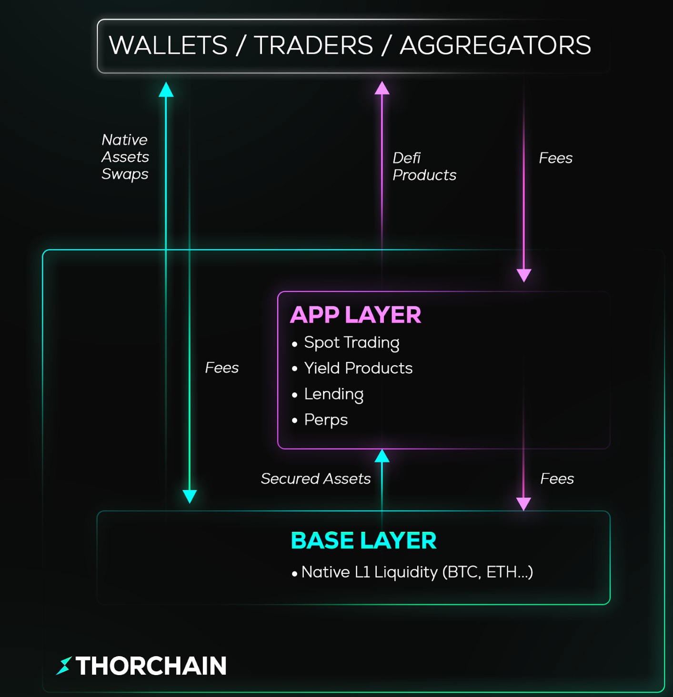

# Application Layer (App Layer)

## Introduction

The App Layer transforms THORChain from being just a cross-chain liquidity protocol into a full ecosystem of financial applications.
It provides an environment for developers to build and deploy decentralized applications (dApps) and financial services, leveraging the security and liquidity of the THORChain base layer.

The **THORChain Base** Layer serves as the foundation – it is responsible for:

- Secure storage and transfer of value
- Native asset swaps across different blockchains (e.g. BTC ↔ ETH)
- Maintaining consensus and network security

The **App Layer** extends these capabilities by giving developers tools to:

- Write and deploy smart contracts (powered by CosmWasm)
- Build applications that directly use the liquidity and functions of the base layer
- Create advanced financial products such as orderbook exchanges, lending protocols, perpetual trading systems, launchpads, or liquidation platforms

In practice, the App Layer works like a "construction site" on top of the THORChain foundation: instead of just simple swaps, it enables the creation of an entire DeFi ecosystem that leverages the security and cross-chain capabilities of the base layer.

## Base Layer (THORChain)

- Manages liquidity pools
- Enables cross-chain swaps (BTC ↔ ETH ↔ ATOM, etc.)
- Provides security and validation

## Application Layer (App Layer = Rujira)

- Built on THORChain, using its liquidity
- Powered by CosmWasm smart contracts → apps can be written in Rust/WASM
- Enables the creation of DeFi tools such as:
  - Orderbook exchanges
  - Perpetuals (leverage)
  - Lending/borrowing
  - Launchpads, liquidations, etc.

## Rujira Economics

The App Layer has its own economic model, centered around the RUJI token:

- RUJI is the native token of the App Layer,
- a portion of application fees is distributed to RUJI stakers,
- revenues are shared between THORChain 50% and Rujira 50%.

<!-- trunk-ignore(markdownlint/MD033) -->

<!-- trunk-ignore(markdownlint/MD033) -->
  

## Simple Analogy

THORChain (Base Layer) = highway → provides core infrastructure, traffic, and security.
App Layer (Rujira) = gas stations, shops, and services along the highway → adds extra functionality and convenience.

The highway itself is essential, but it’s the services around it that make people want to use it.
Similarly, Rujira expands THORChain’s appeal by enabling a full ecosystem of applications.
