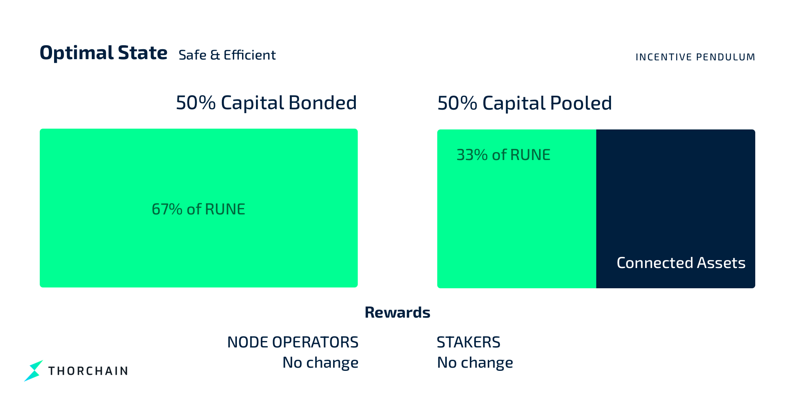
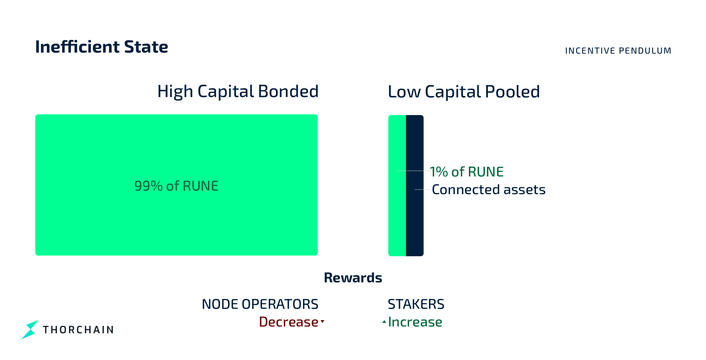

# Incentive Pendulum

The Incentive Pendulum controls the flow of system income between node operators and liquidity providers based primarily on the Effectove Security Bond and Total Vaulted. However, it also accounts for the Effective Bond and the Total Pooled to ensure an equitable and stable reward distribution. This mechanism adjusts the rewards dynamically to maintain a balanced network by incentivising either bonding or pooling as needed.

Key variables to the Incentive Pendulum are:

- **[Total Bonded](https://runescan.io/address/thor17gw75axcnr8747pkanye45pnrwk7p9c3cqncsv)**: Sum of all RUNE bonded by active [node operators](../understanding-thorchain/roles/node-operators.md).
- **Bond Hard Cap** : The highest bond in the bottom 2/3 of active node operators to ensure no single node has excessive influence on the Total Bond.
- **Total Effective Bond**: The sum of all active node operator's bonds up to the Bond Hard Cap. For each node, the bond amount added is capped by the Bond Hard Cap. This maintains a balanced and secure network by distributing bonding power more evenly among node operators.
- **Effective Security Bond**. The sum of the total bond of the bottom 2/3rds active node operators.
- **[Total Pooled](https://runescan.io/address/thor1g98cy3n9mmjrpn0sxmn63lztelera37n8n67c0)**: Sum of liquidity in all [pools](https://runescan.io/pools) by liquidity providers which also includes [synthetics](../thorchain-finance/synthetic-asset-model.md) and [savers](../thorchain-finance/savings.md).
- **Vault Liquidity**: Sum vaule of L1 assets within all Asgard Vaults valued in RUNE. Includes Pooled L1s and Trade Account L1s.

The capital on THORChain can lose its balance over time. Sometimes there will be too much capital in liquidity pools; sometimes there will be too much bonded by nodes. If there is too much capital in liquidity pools, the network is unsafe. If there is too much capital bonded by nodes, the network is inefficient.

If the network becomes unsafe, it increases rewards (block rewards and liquidity fees) for node operators and reduces rewards for liquidity providers. If the network becomes inefficient, it boosts rewards for liquidity providers and reduces rewards for node operators.

## Balancing System States

THORChain can be in 1 of 5 main states:

- Unsafe
- Under-Bonded
- Optimal
- Over-Bonded
- Inefficient

These different states can be observed through the relationship between bonded RUNE and Vaulted Liquidity, reflecting the amount of RUNE bonded by node operators, the amount of liqudity held in the Asgard Vault within or outside the of the liquidity pools.

### Optimal State

In the optimal state:

1. Effective Security Bond is roughly double the Vault Liquidity.
2. Total Effective Bond is roughly 1.5 times the Effective Security Bond.
3. Total Pooled RUNE represents approximately two-thirds of the Vault Liquidity.

This results in:

1. An approximate 67% to 33% split between the Total Security Bond and pooled RUNE.
2. A 50% to 50% split between the Total Security Bond and Vault Liquidity.

It is important to note that yield is paid based on the liquidity provided and not on income share splits, as explained below in the [Algorithm](#algorithm) section.

### Unsafe State

The system may become unsafe. In this case, vaulted capital is higher than bonded capital. Vaulted Rune is now equal to the Effectivity Security Bond – a 50/50 split.

This is undesirable because it means that it's become profitable for node operators to work together to steal assets.

To fix this, the system increases the amount of rewards going to node operators and lowers the rewards going to liquidity providers. This leads to more node operators getting involved, bonding more Rune and increasing bonded capital. This also disincentivises liquidity providers from taking part. They receive less return on their investment, so they pull assets out and reduce the amount of pooled capital. With time, this restores balance and the system moves back towards the optimal state.

### Inefficient State

The system can also become inefficient. In this case, vaulted capital would be much lower in value than bonded capital. This is a problem because it means that much more capital is being put into securing pooled assets than those assets are actually worth.

To fix this, the system increases rewards for liquidity providers and decreases rewards for node operators. This attracts more liquidity providers to the system, and fewer node operators. Liquidity providers add more capital to receive more rewards, increasing pooled capital. Some node operators remove their bonded Rune, seeking more profitable places to put their capital. Bonded capital falls.\
In this way, the system returns to the optimal state.

### Under and Over-Bonded States

The under- and over-bonded states are less severe intermediary states. Being under-bonded is not a threat in itself because it is not yet profitable for node operators to steal. Being over-bonded is not a problem in itself because the system is still operating quite well.

The THORChain team does not expect the unsafe or inefficient states to come up often. The system will be in the over-bonded state most of the time, particularly as it gets easier for people to run nodes.


Try this [interactive model](https://rebase.foundation/network/thorchain/system-component/balancer) of the Incentive Pendulum.


## Algorithm

The algorithm that controls the Incentive Pendulum is as follows:

| Parameters            | Notes                                                              |
| --------------------- | ------------------------------------------------------------------ |
| effectiveSecurityBond | Sum of bottom 2/3 of node operators' bond                          |
| totalEffectiveBond    | Sum of all bonds counting up to the hard bond cap                  |
| vaultLiquidity        | RUNE value of L1 assets in the Asgard Vaults                       |
| pooledRUNE            | Total RUNE in all Pools                                            |
| totalRewards          | Total Block reward (fees + [block emission](emission-schedule.md)) |

1. **Check Security Bond:** No payments to liquidity providers when the `effectiveSecurityBond` is less than or equal to the `vaultLiquidity`:

$$
effectiveSecurityBond \leq vaultLiquidity \implies finalPoolShare = 0
$$

2. **Determine the Initial Share** of rewards for node operators based on the `vaultLiquidity` and `effectiveSecurityBond`:

$$
baseNodeShare= \frac{vaultLiquidity}{effectiveSecurityBond} \times totalRewards
$$

3. **Calculate Base Pool Share** after allocating the `baseNodeShare` to node operators:

$$
basePoolShare = totalRewards - baseNodeShare
$$

4. **Adjust Node and Pool Shares:**

- **Adjust the Node Share** if `totalEffectiveBond` exceeds the `effectiveSecurityBond` so Nodes are rewarded up to the Bond Hard Cap:

$$
adjustmentNodeShare = \frac{totalEffectiveBond}{effectiveSecurityBond} \times baseNodeShare
$$

- **Adjust Pool Share** based on the ratio of `pooledRUNE` to `vaultLiquidity` as non-pooled liquidity is not yield-bearing:

$$
adjustmentPoolShare = \frac{pooledRUNE}{vaultLiquidity} \times basePoolShare
$$

5. **Aggregate the adjusted shares** for both node operators and liquidity providers:

$$
adjustmentRewards = adjustmentPoolShare + adjustmentNodeShare
$$

6. **Calculate the final amount** of rewards allocated to liquidity providers and node operators, ensuring it does not exceed the `totalRewards`:

$$
finalPoolShare = \frac{adjustmentPoolShare}{adjustmentRewards} \times totalRewards
$$

$$
finalNodeShare = \frac{adjustmentNodeShare}{adjustmentRewards} \times totalRewards
$$

Liquidity Providers are paid the `finalPoolShare` and node operators are paid the remainder. However, the income received is based on the liquidity they provided.

7. **Yield Adjustment** based on Liquidity Provided

Ensure the yield (rewards per unit of liquidity) for liquidity providers and node operators is balanced, taking into account the total effective bond and the vault liquidity:

- **Yield for Node Operators:**

$$
nodeYield = \frac{finalNodeShare}{totalEffectiveBond}
$$

- **Yield for Liquidity Providers:**

$$
poolYield = \frac{finalPoolShare}{2 \times pooledRUNE}
$$

This ensures that the rewards are balanced according to the liquidity provided, maintaining the desired incentives for both liquidity providers and node operators.

## Stable Example

Values are:

| Parameters            | Value           |
| --------------------- | --------------- |
| totalEffectiveBond    | 99,000,000 RUNE |
| effectiveSecurityBond | 66,000,000 RUNE |
| vaultLiquidity        | 33,000,000 RUNE |
| pooledRUNE            | 22,000,000 RUNE |
| totalRewards          | 1,000 RUNE      |

### Steps

1. **Check Security Bond:**

   Since `effectiveSecurityBond` (66,000,000 RUNE) is greater than `vaultLiquidity` (33,000,000 RUNE), we proceed with the calculations.

2. **Determine the Initial Share:**

   Base node share calculation:

$$
baseNodeShare = \frac{vaultLiquidity}{effectiveSecurityBond} \times totalRewards = \frac{33,000,000}{66,000,000} \times 1,000 = 500 \text{ RUNE}
$$

3. **Calculate Base Pool Share:**

$$
basePoolShare = totalRewards - baseNodeShare = 1,000 - 500 = 500 \text{ RUNE}
$$

4. **Adjust Node and Pool Shares:**

   - Adjusted node share calculation:

$$
adjustmentNodeShare = \frac{totalEffectiveBond}{effectiveSecurityBond} \times baseNodeShare = \frac{99,000,000}{66,000,000} \times 500 = 750 \text{ RUNE}
$$

- Adjusted pool share calculation:

$$
adjustmentPoolShare = \frac{pooledRUNE}{vaultLiquidity} \times basePoolShare = \frac{22,000,000}{33,000,000} \times 500 = 333.33 \text{ RUNE}
$$

5. **Aggregate the Adjusted Shares:**

$$
adjustmentRewards = adjustmentPoolShare + adjustmentNodeShare = 333.33 + 750 = 1,083.33 \text{ RUNE}
$$

6. **Calculate the Final Amount:**

   Since `adjustmentRewards` (1,083.33 RUNE) exceeds `totalRewards` (1,000 RUNE), we cap the rewards:

   - Final pool share:

$$
finalPoolShare = \frac{adjustmentPoolShare}{adjustmentRewards} \times totalRewards = \frac{333.33}{1,083.33} \times 1,000 = 307.69 \text{ RUNE}
$$

- Final node share:

$$
finalNodeShare = \frac{adjustmentNodeShare}{adjustmentRewards} \times totalRewards = \frac{750}{1,083.33} \times 1,000 = 692.31 \text{ RUNE}
$$

7. **Yield Adjustment:**

   - Yield for node operators:

$$
nodeYield = \frac{finalNodeShare}{totalEffectiveBond} = \frac{692.31}{99,000,000} = 6.993 \times 10^{-6} \text{ RUNE per RUNE}
$$

- Yield for liquidity providers:

$$
poolYield = \frac{finalPoolShare}{2 \times pooledRUNE} = \frac{307.69}{2 \times 22,000,000} = 6.993 \times 10^{-6} \text{ RUNE per RUNE}
$$

### Summary

- Final rewards for liquidity providers: 307.69 RUNE
- Final rewards for node operators: 692.31 RUNE
- Node yield: \( 6.993 \times 10^{-6} \) RUNE per RUNE
- Pool yield: \( 6.993 \times 10^{-6} \) RUNE per RUNE

In this stable state, node yield matches pool yield meaning the system is in equilibrium based on the liquidy provided. This ensures that the rewards are balanced according to the liquidity provided, maintaining the desired incentives for both liquidity providers and node operators.

## Driving Capital Allocation

As a by-product of the Incentive Pendulum's aggressive re-targeting of the 50:50 yield split between node:pool yield, the system aims to maintain an equilibrium where the value of BONDED RUNE is proportionally aligned with the value of Vaulted RUNE. This ensures that:

1. For every unit of POOLED RUNE, there is approximately and 3 times that amount in effectiveSecurityBond, creating a balance that maintains network security and efficiency.
2. As POOLED RUNE is paired 1:1 with pooled assets (due to liquidity pools), the total market value of RUNE is targeted to be three times the value of the pooled assets.
3. There is sufficient bond to secure the non-pooled assets.

If there is any disruption to this balance, the Incentive Pendulum will reallocate rewards to correct the imbalance by incentivising node operators to bond more RUNE or liquidity providers to pool more assets. With the use of [RUNEPool](../thorchain-finance/runepool.md) and [Pooled THORnodes](../thornodes/pooled-thornodes.md) users can play both sides of the  Incentive Pendulum in order to maximise their return and help return the network back into equilibrium.
