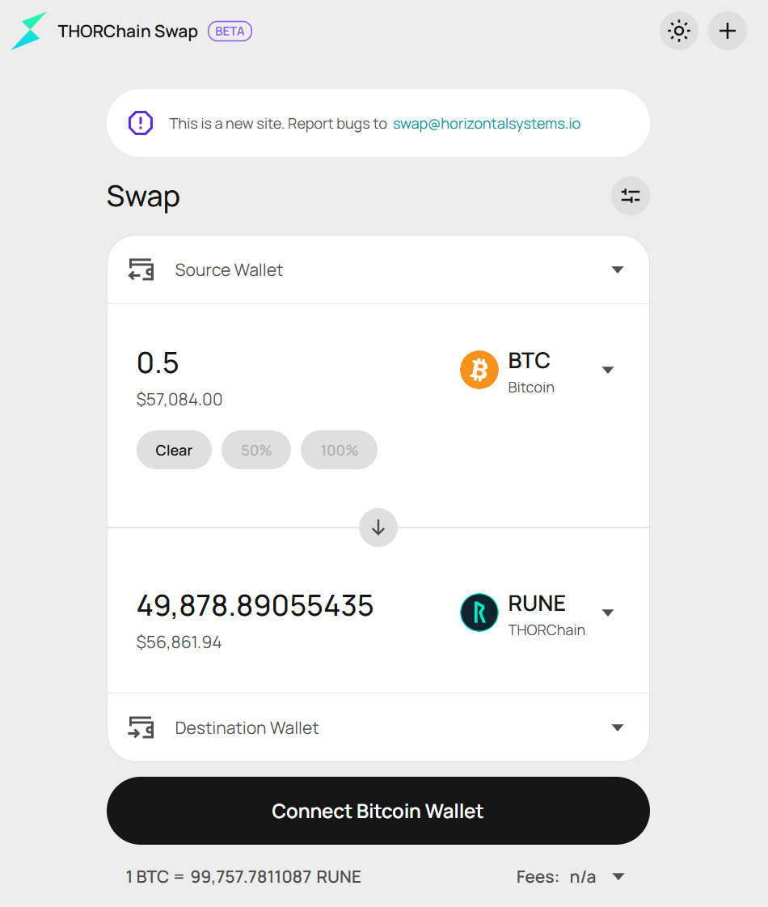
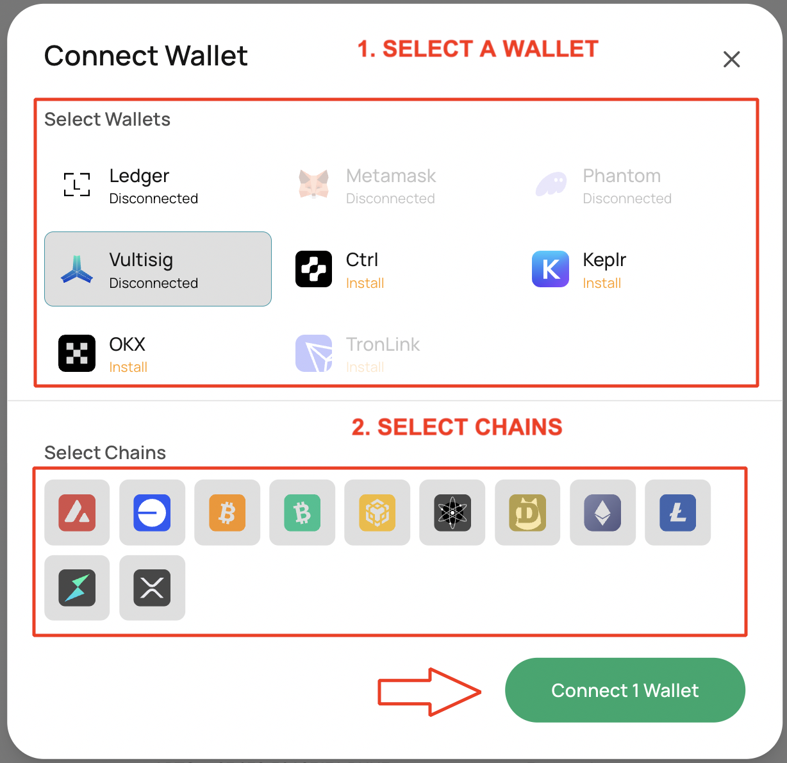
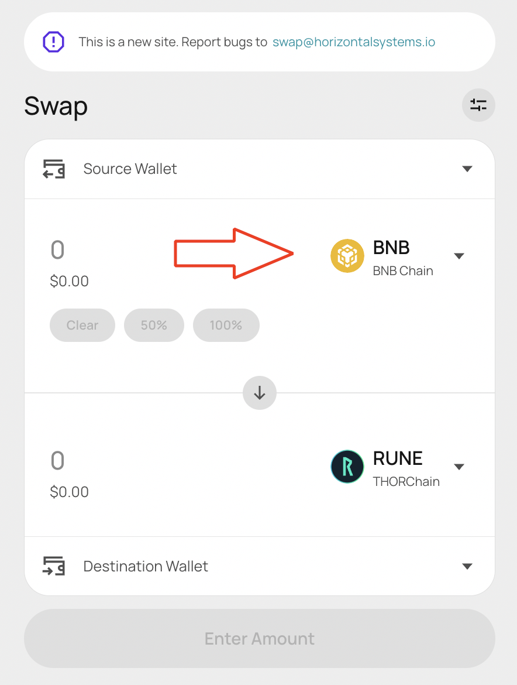
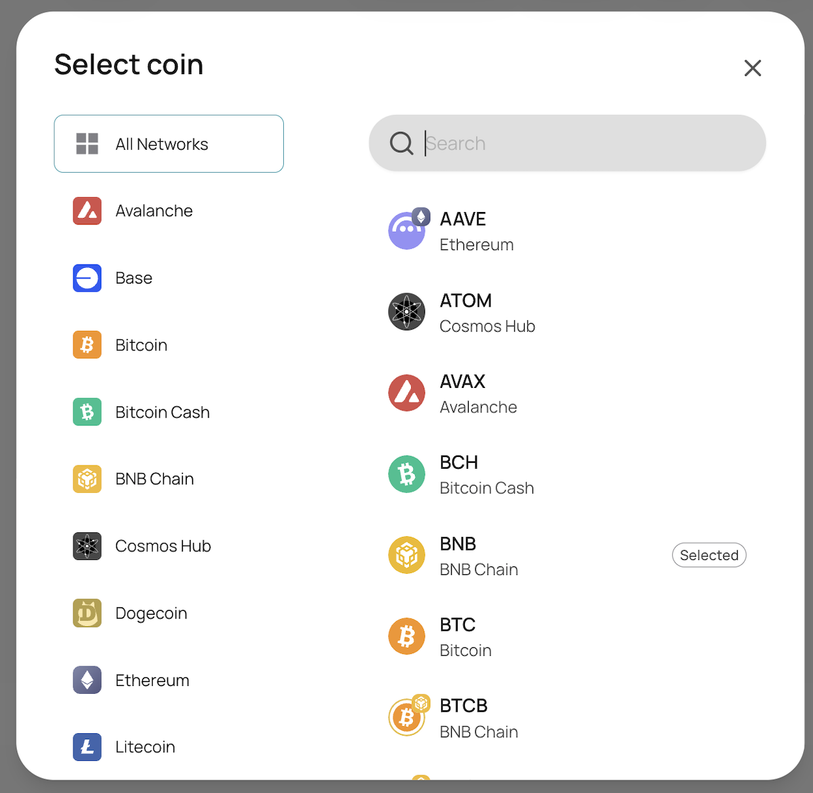
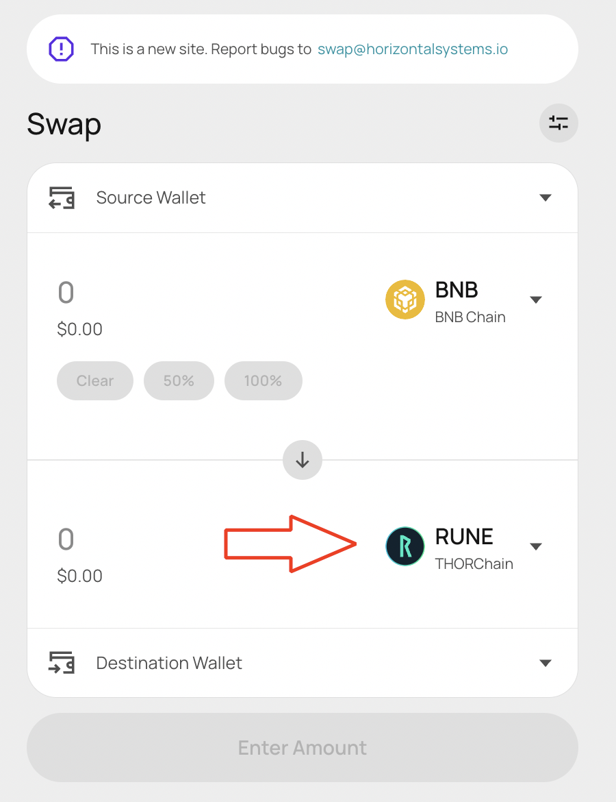
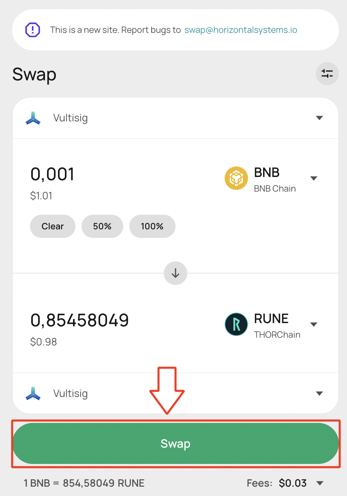

# How to use THORChain (step by step)

1. Create a wallet on your preferred interface (e.g., Vultisig, Keystore, Ledger, etc.).
   Go to the [Ecosystem](./ecosystem.md#integrated-wallets-and-exchanges) page to find a wallet provider.

2. Go to [THORChain's Swap website](https://swap.thorchain.org/)

   <!-- trunk-ignore(markdownlint/MD033) -->
   

3. Connect your wallet
   <!-- trunk-ignore(markdownlint/MD033) -->
   

4. Choose the asset you want to exchange

   <!-- trunk-ignore(markdownlint/MD033) -->
   

   Search for the source coin you want to swap from.

   <!-- trunk-ignore(markdownlint/MD033) -->
   

5. Choose the asset you want to receive
   Same process as selecting a source asset

   <!-- trunk-ignore(markdownlint/MD033) -->
   

6. Review & confirm: check amount, route, fees, and slippage → click Swap, then approve in your wallet if prompted. (Tip: The first time you swap a given token like an ERC-20, you may see two prompts: Approve one-time and then Swap.)

7. Well done! Your transaction is complete
   Press the Swap button and watch the magic happen.
   <!-- trunk-ignore(markdownlint/MD033) -->
   
