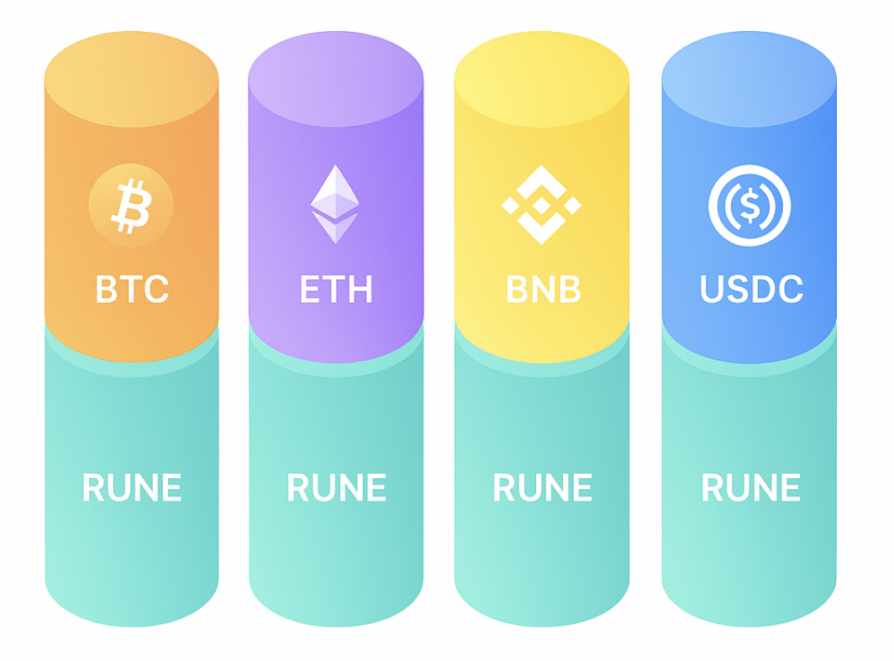
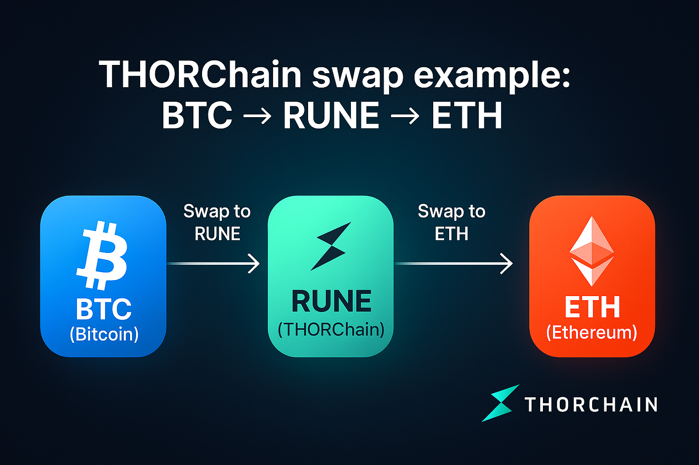

# Native Cross-chain Swaps

THORChain is a decentralized protocol that enables cryptocurrencies to be swapped across different blockchains natively – without using wrapped tokens and without relying on centralized exchanges. This means you can directly exchange one Layer-1 coin (e.g., Bitcoin) for another (e.g., Ethereum) in a single, seamless transaction. The entire process happens without intermediaries – you don’t need to trust any company or institution.

## How Swaps Work in THORChain

### Liquidity Pools and RUNE

Every cryptocurrency supported by THORChain is paired with RUNE in liquidity pools. RUNE acts as a hub that connects all pools into one continuous network. When you swap one coin for another, two steps happen under the hood: your coin is first swapped into RUNE, and then RUNE is swapped into the target coin. For the user, this appears as one simple swap – you don't need to hold or manage RUNE yourself.

### Decentralized Vaults

Each blockchain has its own vault, operated collectively by THORChain's node network. Your funds are deposited there, and after the network confirms the transaction, they are released as the native coin on the destination chain. Thanks to threshold signatures (a type of multi-signature technology), no single node has full control over the funds.

<!-- trunk-ignore(markdownlint/MD033) -->

<!-- trunk-ignore(markdownlint/MD033) -->
  

## Example: Swapping BTC to ETH

1. In your wallet, you choose the swap BTC → ETH and send, for example, 1 BTC to a THORChain vault address on the Bitcoin network.
2. The THORChain network detects the deposit and internally swaps BTC into RUNE in the BTC:RUNE pool.
3. RUNE is then immediately swapped into ETH in the RUNE:ETH pool.
4. The network releases the equivalent amount of native ETH directly to your Ethereum address.
5. In practice, you send BTC and shortly after see ETH in your wallet.

<!-- trunk-ignore(markdownlint/MD033) -->

<!-- trunk-ignore(markdownlint/MD033) -->
  

## Why THORChain is Different

In most cases, swapping assets across blockchains requires either a centralized exchange or cross-chain bridges with wrapped tokens like WBTC. Both approaches involve trusting a third party or custodian that holds your funds.
THORChain eliminates these issues:

- You swap real coins (e.g., BTC, ETH, LTC), not synthetic versions
- You never hand over custody of your funds to a company
- The process is secured by a decentralized network of nodes, each required to bond large amounts of RUNE, incentivizing honest behavior

As a result, THORChain enables true cross-chain swaps: you can easily exchange native BTC for native ETH (and vice versa) in a fully decentralized, secure, and trustless way - with no intermediaries.
