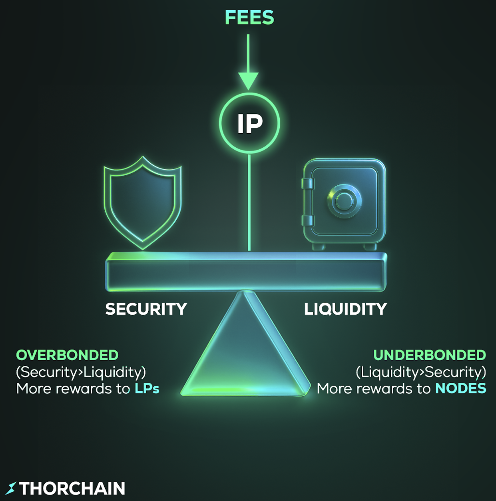

# Economic Model

THORChain’s economic model is designed to maintain network security, ensure liquidity efficiency, and sustain long-term protocol viability. It does this through a combination of the Incentive Pendulum, an emission schedule from the Reserve, and defined inflows and outflows.

## Incentive Pendulum

The Incentive Pendulum automatically adjusts reward distribution between node operators and liquidity providers to maintain the correct balance between security and liquidity.

The system monitors the ratio of bonded RUNE (from node operators) to pooled assets:

- If there is too much liquidity relative to bonded security, the network is unsafe, so rewards shift toward nodes.
- If there is too much bonded capital relative to liquidity, the network is inefficient, so rewards shift toward liquidity providers.

This creates a self-balancing system that maintains the target **2:1 bond-to-stake ratio**, which is central to THORChain's security model.

<!-- trunk-ignore(markdownlint/MD033) -->


Detailed documentation on the Incentive Pendulum can be found in the [developer documentation](https://dev.thorchain.org/concepts/incentive-pendulum.html).


## Emission Schedule

### Token Distribution

There are a maximum of 500M RUNE. All supply was created at genesis and distributed as follows:

- 5% (SEED) and 16% (IDO) sold for capital to start the network and give it value.
- 10% allocated to early developers who worked since 2018.
- 24% given to users who participated in network bootstrapping.
- 44% placed in the Protocol Reserve to pay out to nodes and LPs for the next 10+ years.


All vesting has been completed.


The [Reserve module](https://runescan.io/address/thor1dheycdevq39qlkxs2a6wuuzyn4aqxhve4qxtxt) and [other modules](https://runescan.io/addresses) can be viewed on RuneScan.

### Block Rewards

Block rewards are calculated as:

$$
blockReward = \frac{ \frac{reserve}{emissionCurve}}{blocksPerYear} = \frac{ \frac{180,000,000}{8}}{5256000} = 4.28
$$

If the reserve has 180m RUNE, a single block emits ~4.28 RUNE from the Reserve. Half of that goes to node operators, the rest to liquidity providers. The exact distribution is controlled by the Incentive Pendulum.

The emission curve is designed to start at ~30% APR and trend toward ~2% after 10 years. At that point, most revenue comes from fees rather than block rewards.


The [emission curve](https://dev.thorchain.org/mimir.html#economics) is currently set to 10, meaning block rewards are minimal, approx. 720 RUNE per year.


## Reserve Inflows and Outflows

### Reserve Inflows

1. **Native Transaction Fee**: A 0.02 RUNE fee applies to transactions made on the THORChain blockchain (RUNE, Synthetic Assets, Secure Assets). This is separate from outbound fees, which only apply to external-chain transactions.
2. **Outbound Fees**: Fees collected from all outbound transactions, varying by asset type:
   - **Native Outbound Transaction Fee**: Fixed 0.02 RUNE on RUNE and native asset transactions.
   - **Layer 1 Outbound Fee**: For external-chain assets (e.g., BTC, ETH), this bundles the external gas cost, gas pool swap fee, and THORChain network fee into a single charge. Fee levels are determined by the chain’s gas rate and [`dynamic_multiplier_basis_points`](https://thornode.ninerealms.com/thorchain/outbound_fees).
3. **Withdrawal of Reserve POL**: Occurs when RUNEPool additions replace Reserve-backed POL or when POL requirements are reduced.
4. **Slashing Income**: From node bond slashes, particularly for keygen failures or other operational breaches.
5. **Staged Pool Costs**: Deductions from the staged pool to cover churn-related costs. Controlled by the Mimir variable [`StagedPoolCost`](https://dev.thorchain.org/mimir.html#economics).

### Reserve Outflows

1. **Gas Reimbursement**:
   - **Churn Gas Reimbursements**: Covers migration gas costs during vault churns. Reimbursed by the Reserve and factored into outbound fee adjustments.
   - **Non-Churn Gas Reimbursements**: Reimburses gas for external-chain outbound transactions. Over time, total outbound fees collected for a given coin are designed to equal total reimbursements for that coin.
2. **Reserve Adding to POL**: If undeployed RUNE in RUNEPool is insufficient to cover a withdrawal, the Reserve contributes. If RUNEPool has enough, no Reserve contribution is needed.
3. **Block Rewards**: Paid to node operators and liquidity providers.

### Additional Points

- Gas reimbursements and outbound fees generally balance each other over time.
- POL funding prioritises RUNEPool, with the Reserve acting only as fallback.
- System income (swap fees) is distributed immediately to developers, burns, pools, and nodes, rather than being retained by the Reserve.
