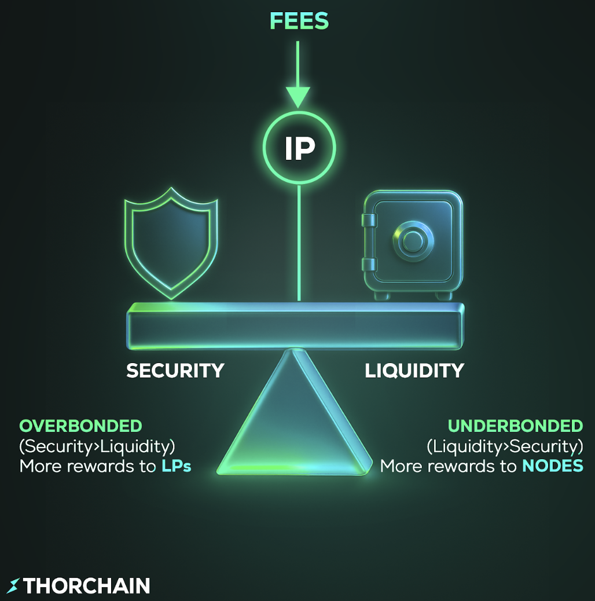

# Economic Model

THORChain’s economic model is designed to maintain network security, ensure liquidity efficiency, and sustain long-term protocol viability. It does this through a combination of the Incentive Pendulum, an emission schedule from the Reserve, and defined inflows and outflows.

## Incentive Pendulum

The Incentive Pendulum automatically adjusts reward distribution between node operators and liquidity providers to maintain the correct balance between security and liquidity.

The system monitors the ratio of bonded RUNE (from node operators) to pooled assets:

- If there is too much liquidity relative to bonded security, the network is unsafe, so rewards shift toward nodes.
- If there is too much bonded capital relative to liquidity, the network is inefficient, so rewards shift toward liquidity providers.

This creates a self-balancing system that maintains the target **2:1 bond-to-stake ratio**, which is central to THORChain's security model.

<!-- trunk-ignore(markdownlint/MD033) -->


Detailed documentation on the Incentive Pendulum can be found in the [developer documentation](https://dev.thorchain.org/concepts/incentive-pendulum.html).


## Emission Schedule

### Token Distribution

There are a maximum of **~360M RUNE** (reduced from 500M per [ADR-023](https://dev.thorchain.org/architecture/adr-023-rune-supply-restructure.html)). Exact max and circulating supply change with burns — use [rune.tools/supply](https://rune.tools/supply) for live figures, or the [Economic Model](https://dev.thorchain.org/concepts/economic-model.html) for protocol detail.

All supply was created at genesis and originally distributed as follows:

- 5% (SEED) and 16% (IDO) sold for capital to start the network and give it value.
- 10% allocated to early developers who worked since 2018.
- 24% given to users who participated in network bootstrapping.
- 44% placed in the Protocol Reserve to pay out to nodes and LPs for the next 10+ years.


All vesting has been completed. ADR-023 later burned most of the Reserve and capped max supply near total supply.


The [Reserve module](https://runescan.io/address/thor1dheycdevq39qlkxs2a6wuuzyn4aqxhve4qxtxt) and [other modules](https://runescan.io/addresses) can be viewed on RuneScan.

### Block Rewards

Block rewards are calculated as:

$$
blockReward = \frac{ \frac{reserve}{emissionCurve}}{blocksPerYear}
$$


The [emission curve](https://dev.thorchain.org/mimir.html#economics) is currently set to 100,000, so block rewards are minimal (on the order of hundreds of RUNE per year). Live values: [Mimir](https://gateway.liquify.com/chain/thorchain_api/thorchain/mimir).

