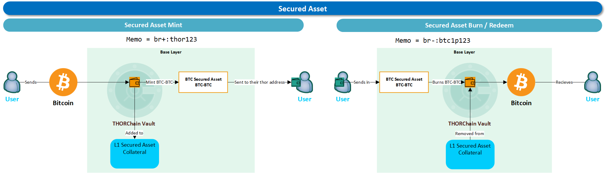
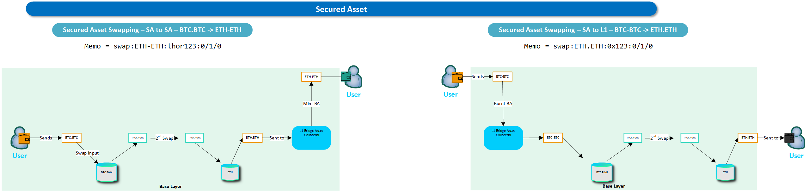

# Secured Assets


This is subject to change as details get worked out. This is not yet implemented. \
See the [Dev Discord](https://discord.com/channels/838986635756044328/1276645235560284260) and [Gitlab MR](https://gitlab.com/thorchain/thornode/-/merge_requests/3711) for more detailed information.

Also see [Technology](../technology/) for generic Cosmos information. What notation will they have?


The plan is for the [delimiter](../frequently-asked-questions/asset-types.md) to be a dash '-'. \
E.g. `ETH.ETH` is L1. `ETH-ETH` will be a secured asset.&#x20;

While ETH.tc is pictured, that may change to `ETH-ETH`.

## How will Secured Assets Move Between Base and App Layer?

Secured assets are x/bank tokens on the App Layer (Rujira) representing 1:1 the native asset on base layer (THORChain)

The native asset is secured to and from the app layer with the following flow:&#x20;

### Mint and Burn Secured Assets

Example shows the mint and burn process for BTC

<figure><figcaption></figcaption></figure>

### Swapping Secured Assets

Examples below explain how a user:

1. Swap a Secured Asset (SA)—BTC—to another Secured Asset—ETH
2. Swap a Secured Asset—BTC—to a base asset—ETH

<figure><figcaption></figcaption></figure>

Find more information about [Secured Assets](https://docs.rujira.network/developers/secured-assets) in the Rujira Docs

