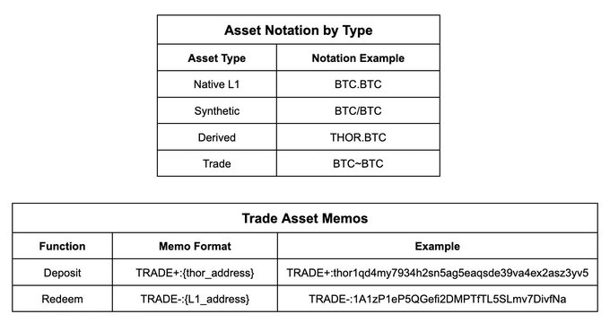

# Trade Assets

A new class of primitives, known as Trade Assets, has been introduced on THORChain. These assets offer twice the capital efficiency of [synthetic assets](synthetic-asset-model.md), enhancing the effectiveness of arbitrageurs with the same capital. Trade accounts settle with THORChain's block speed and cost, enabling swaps with 6-second finality without excessive network fees.

Trade Assets can be redeemed for native assets anytime with no slippage, making them ideal for arbitrageurs and high-frequency traders. Trade Assets emulate the experience of trading on a centralized exchange, without compromising on transparency or security. They represent a significant step in making THORChain more user-friendly for high-frequency traders. With twice the capital efficiency of Synthetic Assets, arbitraging pools becomes much more efficient, leading to tighter price spreads across exchanges.

In short, Trade Assets provide active traders with an experience akin to trading on a centralized exchange, but entirely on-chain, without compromising transparency or security.

### What are Trade Assets?

Trade Assets are native assets custodied by THORChain but held outside of liquidity pools. Users receive a credit to their THORChain address, while the assets are held by a protocol-controlled module. Unlike synthetic assets, Trade Assets are not held directly by user wallets. Conceptually, Trade Assets resemble a deposit on a centralized exchange, but with the transparency of being on-chain. Funds are held 1:1 as L1 assets by THORChain until the user withdraws them back to self-custody.

### Advantages of Trade Assets

- Backed 1:1 by native assets secured by THORChain
- Mint or redeem Trade Assets with no slippage (only L1 gas fees)
- 2x capital efficiency of Synthetic Assets
- No outbound fee when swapping to a Trade Asset
- Finality with THORChain block speed (6 seconds)
- Not subject to outbound delays or confirmation counting

### Trade Assets vs Synthetic Assets: Key Differences

Trade Assets allow faster and more capital-efficient arbitrage of the pools compared to [Synthetics](synthetic-asset-model.md). Synthetics adjust one side of the pool depth, causing only half the price movement, while Trade Accounts use full capital efficiency for price corrections. For example, a $100 RUNE → BTC swap requires $200 of Synthetic BTC to correct the price, whereas Trade Accounts only need $100 to achieve the same correction. This enables quicker restoration of price deviations with less capital.

<figure><figcaption></figcaption></figure>

### Why Transition to Trade Assets Now?

With THORChain's growth and increased decentralization, the network is now resilient to attacks that previously limited the feasibility of Trade Assets. The launch of Trade Assets presents new opportunities for arbitrage, order books, high-frequency trading, and P2P lending markets, leveraging the network's robust security and efficiency.

### Dashboards tracking Trade Assets

There are multiple dashboards to track the performance of RUNE added to the RUNEPool:

- [https://thorchain.network/trade](https://thorchain.network/trade)
- [https://thorchain.net/thorfi/trades](https://thorchain.net/thorfi/trades)
- [https://runescan.io/txs?type=traders](https://runescan.io/txs?type=traders)

Dashboards for Trade Assets continuously evolve as THORChain expands, but taking the example of [THORChain.network](https://thorchain.network/trade/) you will find the following in the dashboard:

- Trade Asset: Which asset minted as a Trade Asset
- Price: Current price of 1 unit of the Trade Asset
- Balance: How many units of the Trade Asset has been minted
- Valuation: Price \* Balance
- Pool Ratio: How much the Trade Asset make up entire Trade Asset pool does this account for &#x20;

<figure><figcaption></figcaption></figure>

### Economic Security

Trade Assets are the first to be held outside liquidity pools on THORChain. This means that not all native assets in TSS Vaults are paired with RUNE. To maintain network economic security, the [Incentive Pendulum](../how-it-works/incentive-pendulum.md) now considers the value of all assets in the vaults, not just those in pools, when distributing rewards between Nodes and LPs. If the value of vault assets exceeds bonded value, Trade Accounts may face negative interest rates until the value ratio is balanced.

To ensure the security of the network, if the combined pool and trade account value exceeds the total bonded value, trade assets will be liquidated to buy RUNE and deposited into the bond module. This safeguard ensures liquidity redistribution to Active Node Operators and occurs only if the Incentive Pendulum is underbonded.

### Using Trade Accounts

#### How Trade Accounts Work

1. **Deposit L1 assets**: Traders deposit L1 assets into the network, minting a Trade Asset in a 1:1 ratio within a Network Trade module.
2. **Receive accredited shares**: Traders receive accredited shares of this module relative to their deposit.
3. **Swap/Trade assets**: Traders can swap/trade assets with RUNE or other trade assets within the module.
4. **Withdraw balance**: Traders can withdraw from their Trade Account with an outbound delay.

#### How to Mint or Burn Trade Assets

Minting or burning trade assets involves using a specific memo syntax, prefixed with `TRADE+` or `TRADE-`. The asset name is inferred from the received asset, and no slippage fees apply, only L1 gas fees. For example, depositing 1 BTC.BTC will result in the crediting of 1 BTC\~BTC (minus BTC network gas fees), and withdrawing 1 BTC\~BTC will result in the crediting of 1 BTC.BTC (minus network fees).

#### Adding to the Trade Account

To add to the Trade Account, send L1 Asset to the Inbound Address with the memo: `TRADE+:THORADD`. Example:

```makefile
TRADE+:thor1g6pnmnyeg48yc3lg796plt0uw50qpp7humfggz
```

This adds the sent asset and amount to the Trade Account.

#### Swapping Trade Assets

Use the swap memo when swapping to and from trade assets. Example:

```makefile
=:ETH~ETH:thor1g6pnmnyeg48yc3lg796plt0uw50qpp7humfggz
```

Swap (from RUNE) to Ether Trade Asset.

#### Withdrawing from the Trade Account

To withdraw, send a THORChain MsgDeposit with the memo `TRADE-:ADDR`. Example:

```makefile
TRADE-:bc1qp8278yutn09r2wu3jrc8xg2a7hgdgwv2gvsdyw
```

Withdraw 0.1 BTC from the Trade Account and send to the specified address.

#### Verifying Trade Account Balances

Balances can be verified using the Owner's THORChain Address via the `trade/account/` endpoint. Example:

```url
https://thornode.ninerealms.com/thorchain/trade/account/thor1g6pnmnyeg48yc3lg796plt0uw50qpp7humfggz
```

### Future Opportunities

- **Arbitrage bots**: Enhance trading efficiency.
- **Order books and high-frequency trading**: Support advanced trading strategies.
- **P2P Lending market**: Enable deposit of one trade asset and withdrawal of another, with dynamic reserve asset interest rates.

### Sources

1. Trade Accounts [Dev Docs](https://dev.thorchain.org/concepts/trade-accounts.html)
2. Relevant PRs: [!3347](https://gitlab.com/thorchain/thornode/-/merge_requests/3347)&[!3451](https://gitlab.com/thorchain/thornode/-/merge_requests/3451)
3. [Twitter Spaces](https://twitter.com/THORChain)— held most weeks,[subscribe on RSS](https://rss.com/podcasts/thorchain/)or wherever you get your podcasts
4. [THORChain University](https://crypto-university.medium.com/)— educational content, monthly posts, &[discord](https://discord.com/invite/c4EhDZdFMA)server
5. [GrassRoots Crypto](https://www.youtube.com/c/grassrootscrypto)— update and explanation videos
