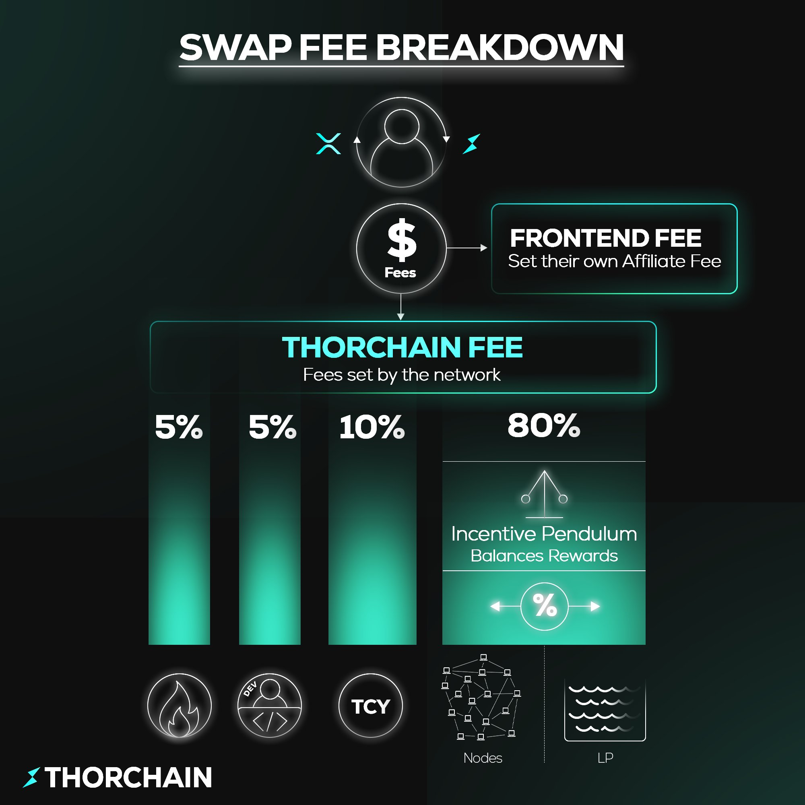

# Tokenomics of RUNE and TCY

RUNE is the native utility token of the THORChain ecosystem, and it sits at the core of how the network functions. Unlike many other crypto assets, RUNE has no vesting schedules or locked allocations – the full supply is already released, and thanks to its burn mechanism, the circulating amount decreases over time. This makes RUNE both the economic backbone and the primary incentive driver of THORChain.

## RUNE Tokenomics

- **Total Supply:** ~425M RUNE (reduced daily through the burn mechanism)
- **Circulating Supply:** ~350M RUNE
- **Reserve:** ~75M RUNE
- **Latest numbers:** [rune.tools/supply](https://rune.tools/supply)

All RUNE tokens have been released – there are no vesting schedules or locked allocations.

## Main Functions of RUNE in THORChain

### Settlement Asset

- All transactions and swaps in the network are settled in RUNE.

### Network Security (Bonding)

- Validators (nodes) must bond RUNE to participate in consensus.
- The more RUNE is bonded, the more economic security the network has.
- Running a node allows you to earn a share of THORChain's revenue.
- Delegating RUNE to nodes lets you participate in revenue distribution.

### Liquidity

- RUNE is present in every liquidity pool (e.g., BTC–RUNE, ETH–RUNE).
- This ensures a unified pricing system and constant demand for RUNE.

### Burn

- A portion of fees collected by THORChain is burned.
- This gradually reduces RUNE supply and gives it a deflationary character.

### Incentives

- Validators and liquidity providers earn rewards in RUNE.
- These rewards come from network-generated fees, not from new token emissions.

## Revenue in THORChain

One of THORChain's biggest advantages is that it generates **real yield** – 100% derived from network activity, not from token inflation.

The network processes thousands of cross-chain swaps and transfers daily, producing on average **$50,000 - $100,000 per day** in fees.

These fees are the foundation of real yield in the ecosystem.

🔗 **Latest revenue data:** [raynalytics.net/dashboards/system-income](https://raynalytics.net/dashboards/system-income)

## Revenue Distribution

The current fee distribution in THORChain is as follows:

- **5%** → burned
- **5%** → developer fund
- **10%** → TCY holders (explained below)
- **80%** → validators (nodes) and liquidity providers (LPs)
  - The exact split between them is determined by the Incentive Pendulum

<!-- trunk-ignore(markdownlint/MD033) -->

  

## TCY Token

TCY was created to resolve THORChain's debt issue (~$210M after the ThorFi crisis).

Each $1 of debt was converted into 1 TCY. This way, creditors received tokens instead of a total loss, giving them the right to a share of the network's future revenue. This helps stabilize the ecosystem and align the community's interests with the protocol.

### How to Get TCY

- **TCY can be claimed** through the official interface: [tcy.thorchain.org](https://tcy.thorchain.org/)
- A THORChain address is required to claim.
- Claimed tokens are automatically staked and immediately start generating daily yield.

### TCY Supply

- **Total Supply:** 210M
- **Circulating Supply:** 176M

🔗 **Latest numbers:** [raynalytics.net/analytics/tcy](https://raynalytics.net/analytics/tcy)

### How does TCY work?

- **TCY holders receive 10% of all network revenue** (paid in RUNE).
- A RUNE/TCY liquidity pool was created, so the token can be freely traded.
- Stakers retain their yield, while the yield from unclaimed or unstaked TCY is forfeited and redirected to grow protocol-owned reserves.
- Fees from this pool are used to buy back TCY into the THORChain treasury.
- ⚠️ **TCY does not provide voting rights** or influence in the governance of the THORChain network – it is solely an income-generating economic token.
