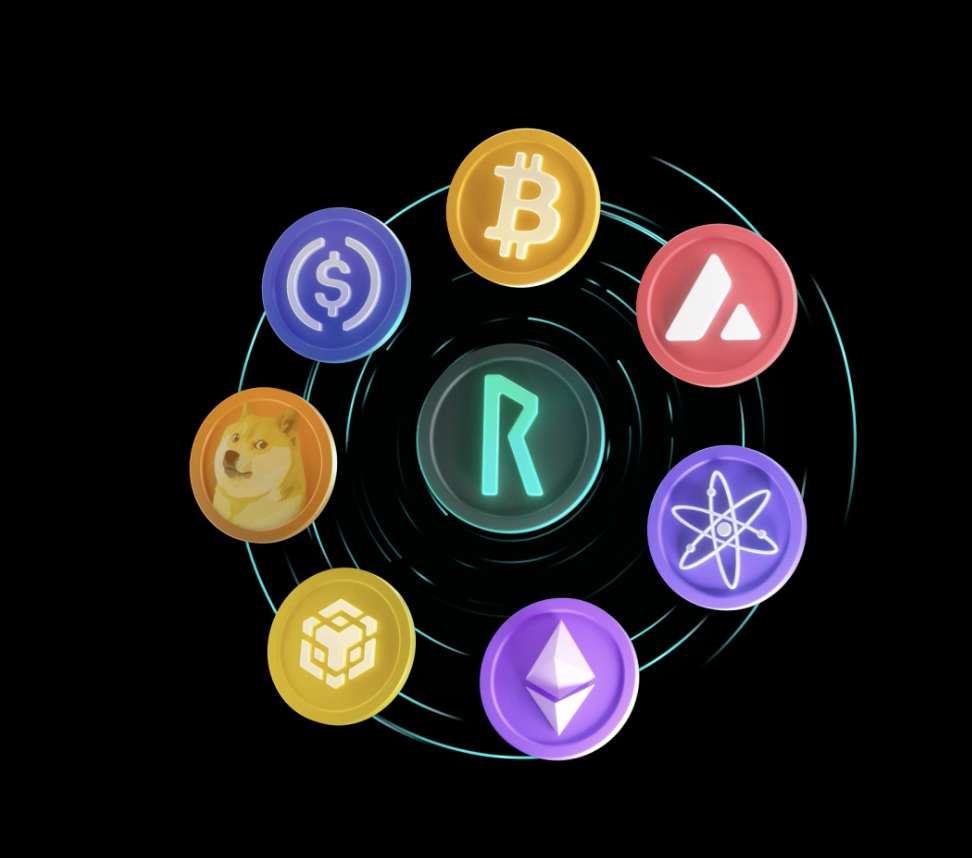

# What is THORChain? ⚡

THORChain is a Layer-1 blockchain that enables different cryptocurrencies to work together. It acts as a decentralized exchange (DEX) that allows you to swap coins across different blockchains in a single step.

Every swap on THORChain happens directly from your wallet in a safe and permissionless way.
THORChain never takes custody of your coins, so you always remain in control and possession of your funds.

Unlike centralized exchanges:

you don't need an account;
there is no KYC or paperwork;
you don't have to trust a company to hold your funds.

Example:
If you own Bitcoin and want Ethereum, you just send Bitcoin from your wallet and receive Ethereum back instantly—no exchange accounts, no delays, no middlemen.

<!-- trunk-ignore(markdownlint/MD033) -->

<!-- trunk-ignore(markdownlint/MD033) -->
  

## Supported Blockchains

THORChain enables native swaps between the following major blockchains:

- Bitcoin (BTC)
- Ethereum (ETH)
- Ripple (XRP)
- BNB Smart Chain (BNB)
- Bitcoin Cash (BCH)
- Litecoin (LTC)
- Dogecoin (DOGE)
- Avalanche (AVAX)
- Base (BASE)
- Cosmos Hub (ATOM)

THORChain will continue to evolve and add more chains over time, so users will be able to swap even more popular cryptocurrencies—all without wrapped tokens or intermediaries.

THORChain is a full blockchain (like Ethereum or Solana). This means that, in addition to swapping, developers can build smart contracts and decentralized apps (dApps) on top of it. This makes THORChain not only a trading tool but also a foundation for the next generation of DeFi projects.

## What is RUNE?

RUNE is the native utility token of THORChain that serves four critical functions:

### 1. Settlement Asset

- All transactions and swaps in the network are settled in RUNE
- RUNE acts as the bridge connecting all supported blockchains

### 2. Network Security (Bonding)

- Validators must bond RUNE to participate in consensus
- More bonded RUNE makes the network harder to attack
- Running a node allows earning a share of THORChain's revenue

### 3. Liquidity

- RUNE is present in every liquidity pool (BTC–RUNE, ETH–RUNE, etc.)
- This ensures unified pricing and constant demand for RUNE

### 4. Governance and Incentives

- Validators and liquidity providers earn rewards in RUNE
- These rewards come from real network fees, not token inflation
- RUNE holders participate in network governance through validator delegation

---

## Next Steps

Now that you understand what THORChain and RUNE are, explore how it works:

- **[Native Cross-chain Swaps](native-cross-chain-swaps.md)** - Learn how THORChain enables direct swaps between different blockchains
- **[How to Use THORChain](how-to-use-thorchain.md)** - Step-by-step guide to start swapping
- **[Tokenomics](tokenomics-rune-tcy.md)** - Deep dive into RUNE's economics and revenue model
